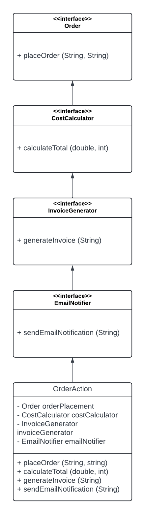

# OOP_Lab_Assignment_6
Order Management System
----
This project is an Order Management System that provides a simple interface for managing orders, calculating costs, generating invoices, and sending email notifications. The system follows SOLID design principles to ensure flexibility and maintainability.

Features
----
> Order Placement: Place orders with a customer name and address.  
> Cost Calculation: Calculate total costs based on price and quantity.  
> Invoice Generation: Generate invoices for orders.  
> Email Notifications: Send email alerts to specified addresses.

Diagram
----

